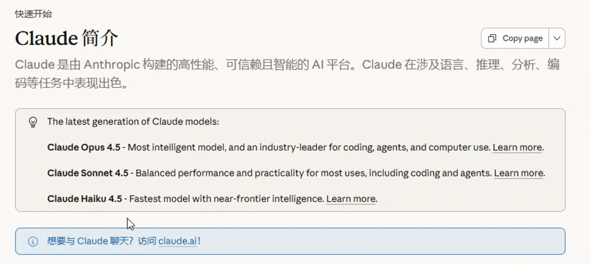

# LineLock

一款浏览器扩展插件，为网页带来类似代码编辑器的**矩形选择 / 列选择**功能。

## 快速了解

LineLock 是一个增强浏览器选择的扩展：

- ✔ 可在网页中按列选择文本
- ✔ 支持类似编辑器的矩形选择
- ✔ 选择后自动复制到剪贴板
- ✔ 支持滚动扩展选区 & 多种触发键

## 演示



## 功能特性

- **矩形区域选择** - 突破浏览器原生的线性文本选择限制，支持按列选取字符
- **自动复制** - 选择完成后自动复制到剪贴板
- **滚轮滚动** - 选择过程中支持滚轮滚动，可选取超出视口的内容
- **可配置触发键** - 支持多种组合键和鼠标中键触发
- **轻量无侵入** - 不修改页面 DOM，不收集任何数据

## 浏览器兼容性

| 浏览器 | 支持情况 |
|--------|----------|
| Google Chrome | ✅ 完全支持 |
| Microsoft Edge | ✅ 完全支持 |
| Firefox | ⚠️ 部分支持 |

## 安装方法

### 从源码安装

1. 下载或克隆本仓库到本地
2. 打开浏览器扩展管理页面
   - Chrome: `chrome://extensions/`
   - Edge: `edge://extensions/`
3. 开启右上角 **开发者模式**
4. 点击 **加载已解压的扩展程序**
5. 选择本项目文件夹

> **注意**: 安装扩展后，在安装前已打开的页面需要**刷新页面**才能激活扩展功能。

## 使用方法

### 基本操作

> **重要**: 必须先按住组合键，再进行鼠标操作

1. **按住** `Ctrl + Alt` 组合键（默认）
2. **鼠标左键按下** 起始位置
3. **拖动鼠标** 框选矩形区域
4. **松开鼠标** 完成选择，内容自动复制到剪贴板

### 滚动选择

选择过程中（保持鼠标按下状态），可使用**鼠标滚轮**上下滚动页面，选区会自动扩展。

### 取消选择

选择过程中按 `Esc` 键可取消当前选择。

## 配置选项

点击浏览器工具栏的插件图标，打开设置面板：

| 选项 | 说明 |
|------|------|
| 启用插件 | 开启/关闭插件功能 |
| 触发方式 | 选择触发组合键或鼠标中键 |
| 高亮颜色 | 自定义选区高亮颜色 |

### 触发方式说明

| 触发方式 | 操作方法 | 推荐场景 |
|----------|----------|----------|
| **Ctrl + Alt** | 按住组合键 + 鼠标左键拖拽 | 默认推荐，兼容性最佳 |
| Alt + Shift | 按住组合键 + 鼠标左键拖拽 | 仅 Chrome（与 Windows 输入法切换冲突） |
| Ctrl + Shift | 按住组合键 + 鼠标左键拖拽 | 备选方案 |
| 鼠标中键 | 直接中键拖拽 | 最稳定，无快捷键冲突 |

## 使用场景

- 网页日志查看与复制
- 表格数据按列提取
- 数字序列快速复制
- 代码片段列对齐复制
- 运维 / 数据分析页面操作

## 示例

页面内容：
```
ID    Name    Score
001   Alice   95
002   Bob     87
003   Carol   92
```

使用列选择复制 ID 列：
```
001
002
003
```

## 已知限制

| 场景 | 说明 |
|------|------|
| 比例字体 | 非等宽字体可能存在对齐偏差 |
| Shadow DOM | 不支持深层穿透 |
| 跨域 iframe | 无法选择 |
| Canvas / PDF | 不支持 |

## 技术实现

- 使用 `document.caretRangeAtPoint()` / `document.caretPositionFromPoint()` 定位字符
- 基于 DOM Range API 计算字符边界
- 自定义高亮层渲染选区视觉效果
- Clipboard API 实现剪贴板写入

## 项目结构

```
column-selector/
├── manifest.json    # 扩展清单 (Manifest V3)
├── content.js       # 核心选择逻辑
├── popup.html       # 设置面板
├── popup.js         # 设置逻辑
├── popup.css        # 设置样式
└── icons/           # 图标资源
```

## 许可证

MIT License

## 贡献

欢迎提交 Issue 和 Pull Request。
